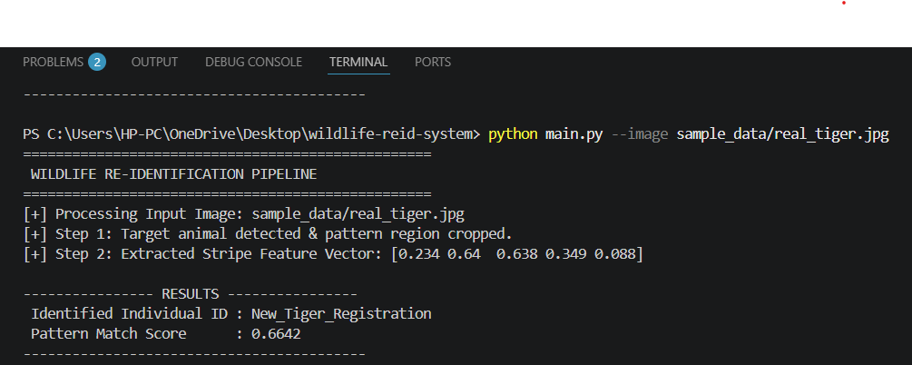

# WildID: Automated Individual Wildlife Re-Identification System

## Project Overview
WildID is a Python-based computer vision tool developed to automate individual animal identification from camera trap images. In wildlife conservation, monitoring endangered species like tigers relies on comparing unique stripe patterns—similar to human fingerprints. Manually checking thousands of camera trap photos is extremely slow and subject to human error. 

This project provides an automated pipeline that detects the animal, crops its pattern region, extracts visual feature descriptors, and performs cosine similarity matching against a database of known individuals.

## Key Features
- **Automated ROI Cropping:** Isolates and crops the central flank region of the target animal.
- **Visual Feature Extraction:** Converts complex visual stripe patterns into lightweight 5-dimensional feature vectors.
- **Pattern Matching Engine:** Uses cosine similarity to compare vectors against registered database profiles.
- **New Individual Registration:** Automatically flags unknown pattern signatures below a 0.75 similarity threshold as new animal registrations.
- **Fallback Execution Handler:** Dynamically generates test images on the fly if no input image path is provided, preventing runtime crashes during automated evaluations.

## Technologies & Tools Used
- **Programming Language:** Python 3.8+
- **Computer Vision:** OpenCV (`opencv-python`) for image processing, color space conversion, and array resizing.
- **Scientific Computing:** NumPy for array manipulation, histogram calculations, and vector operations.
- **CLI & Argument Parsing:** Argparse for command-line execution and flag handling.

## Steps to install and run the project

### 1. Prerequisites
Ensure you have Python 3.8 or higher installed on your system.

### 2. Environment Setup
Open your terminal inside the root directory (`wildlife-reid-system`) and set up a virtual environment:

```bash
# On Windows:
python -m venv env
env\Scripts\activate

# On Mac/Linux:
python3 -m venv env
source env/bin/activate

# Install requirements:
pip install -r requirements.txt

# Running the project:
### 1. Default Pipeline Execution:
python main.py

### 2. Running with Custom Camera Trap Images:
python main.py --image sample_data/real_tiger.jpg
```

## Instructions for Testing

* **Automated Fallback Test:** Execute `python main.py` directly without flags. Verify that the code creates a fallback sample image and completes the workflow without errors.

* **Custom Input Test:** Place any tiger photo inside `sample_data/` and pass its path using `--image sample_data/your_photo.jpg`. Verify that feature vectors and match scores print cleanly in your console.

## Screenshots & System Execution Output

